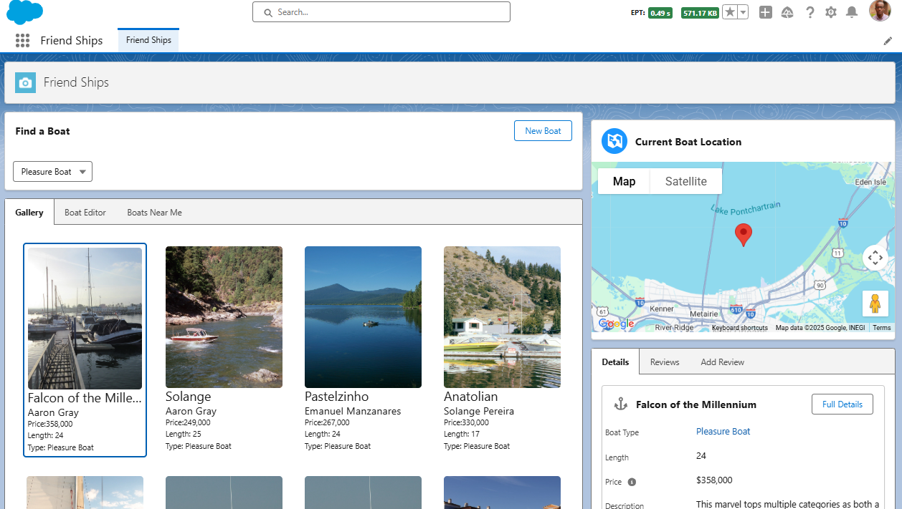
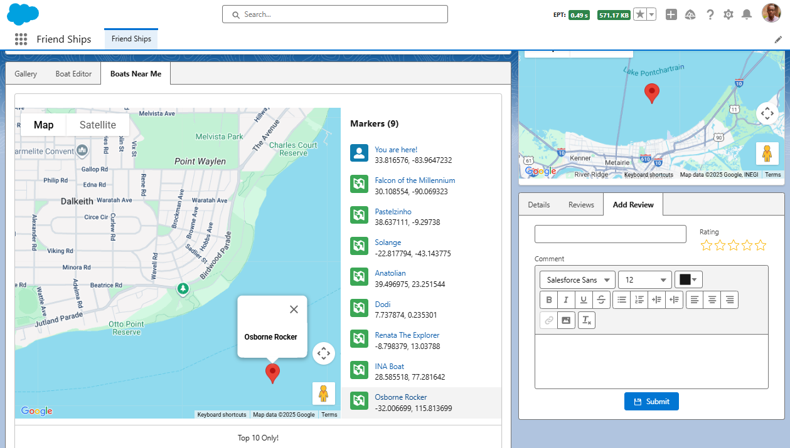
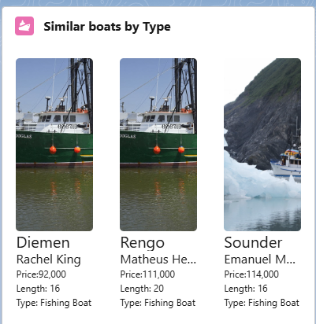
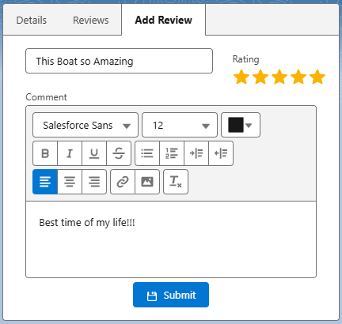
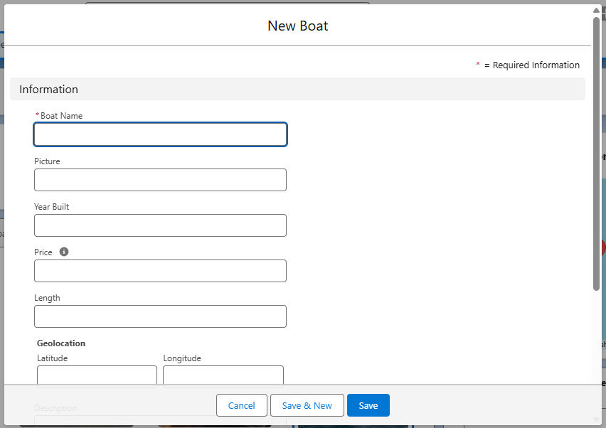

# SF_Friend-Ships ⛵

This app simulates a boat-sharing program where administrators can view boats, add new ones, and rate them — all through a sleek, custom Lightning experience.

##### This Project highlights all the following Fundamentals 🛠️ :

- Salesforce Lightning Web Components (LWC)
- Apex (Server-side logic)
- Lightning Data Service
- Salesforce DX (SFDX)
- JavaScript, HTML, and CSS

## Features ✨

- ### Boat Management 📊
  
  - View available boats.
  - Add new boats with details like type, name, and description.
  - Rate boats based on user experience.

- ### Filtering & Search 🔍
  
  - Filter boats by type (e.g., Sailboat, Yacht, Motorboat).
  - Quickly locate boats through search functionality.

- ### Ratings ⭐
  
  - Rate boats directly in the UI.
  - View average ratings for each boat.

- ### Built with LWCs ⚡
  
  - Utilizes Lightning Data Service for CRUD operations.
  - Custom events for component communication.
 
## Impact🌍 

Organizations can leverage this app as a template for similar use cases where objects need to be:
  - Listed, Filtered, and Rated — useful for asset management, equipment rentals, property listings, and more.
  - Centrally Managed — admins maintain full control over records in Salesforce.
  - Extended Easily — additional features like booking, scheduling, or custom workflows can be added.

